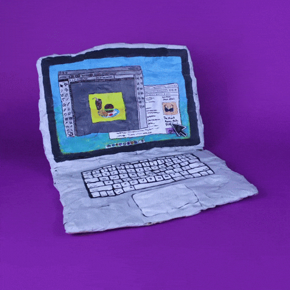

<h1>
  Hello , 👋 I’m gaurav 😁
</h1>

 

  

<samp>

if you <i>read</i> my <b>profile</b>, 
you'll know how to <i>read</i> better 
next time.

</samp>

   

<samp>

yes, I yummm a computer-science student. 
and my every contribution as a CS student is 
live on GitHub and what I do and how I do is 
live on my portfolio.

</samp>

    

<table>
<tr>

<td valign="middle">

<samp>
I love to  
I love to  
I love to  
I love to
</samp>

</td>

<td align="center" valign="middle">

</td>

<td valign="middle">

<samp>
skate.  
skate.  
skate.  
code.
</samp>

</td>

</tr>
</table>

  

<samp>
  

  

</samp>

###

<picture>
  <source media="(prefers-color-scheme: dark)" srcset="https://raw.githubusercontent.com/gauravk16in/gauravk16in/output/pacman-contribution-graph-dark.svg">
  <source media="(prefers-color-scheme: light)" srcset="https://raw.githubusercontent.com/gauravk16in/gauravk16in/output/pacman-contribution-graph.svg">
  
</picture>

###
